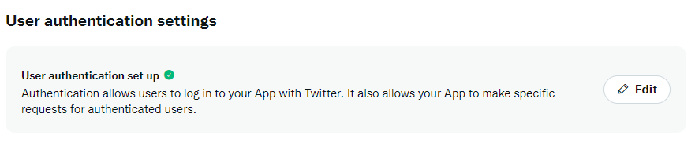

# Walking Frames

A Twitter bot that posts every frame of a TV series/movie in order.  
Made with [Tweepy](https://docs.tweepy.org/en/stable/) and [OpenCV](https://docs.opencv.org/4.x/d6/d00/tutorial_py_root.html).
## Installation (Windows)
```
git clone https://github.com/Zike01/WalkingFrames.git
cd WalkingFrames
pip install -r requirements.txt
```

## Usage

### Frames processor
Create a video folder (input) and images folder (output). This can be anywhere on your computer.  
Open **framesprocessor.py** and set the **VIDEO_PATH** and **IMAGE_PATH** at the top of the file.


Make sure the **EXTENSION** matches the extension of the video files.    
Paste videos in your video folder and organise the folders like so:\


**ALL VIDEOS SHOULD HAVE THE SAME NAMING CONVENTION (S0Xe0X) FOR THE PROGRAM TO RUN**

- Run framesprocessor.py
- Enter the current season you wish to process
- Wait for output images to appear in the image folder.
- Repeat for every season

### Twitter API
Create a .env file in the project folder and set up the constants.


Create a Twitter developer account and open the [developer dashboard](https://developer.twitter.com/en/portal/dashboard)

In settings make sure you set up user authentication (read and write). This will allow you to post your tweets.


Go to Keys and tokens and generate the tokens required for authentication.


Paste the newly generated values in the .env file. In case you lose these values they can be regenerated at any time through the developer portal.

### Main Script
All you need to do here is change the TITLE constant to the name of the TV Show/movie you wish to post. You can also change the tweet caption on line 67 if you're posting movie frames.  
Rename **sample_config.txt** to **config.txt** and configure the starting season, episode and frame. 


### Task Scheduler
Find a way to schedule your script to run every X minutes. For windows you can use the [task scheduler](https://www.youtube.com/watch?v=4n2fC97MNac):

For free accounts you can only post 50 tweets/day, or roughly 1 tweet every 30 minutes.
